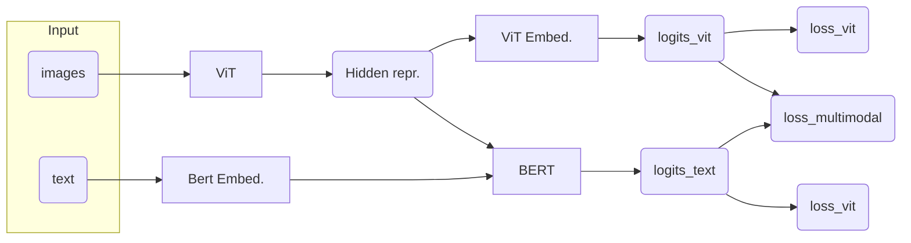

# Chujian Glyph Recognition With Multimodal Transformer Model

This model combines ViT and BERT to perform classification on Chujian glyphs. It attempts to utilize contextual information (glyphs before and after the target glyph).

## Usage

Most hyperparameters are hardcoded in `train.py` and `modeling/vit_bert.py`.

```bash
python train.py
```

## Model Architecture

The ViT is pretrained with visual date (using <https://www.github.com/donny-chan/chujian-classifier>). This model adds a BERT on top of it, which predicts the characters in an MLM manner. The logits of both ViT and BERT are combined to make the final prediction.



Currently uses a window of 8 characters, and each window may contain more than one masked model.

## Developer's Note

There are also two sister repos containing code for classification using only visual input with ViT and only (contextual) text input with BERT:

- [Chujian Glyph Recognition With ViT](https://www.github.com/donny-chan/chujian-classifier)
- [Chujian Glyph Recognition With BERT and MLM](https://www.github.com/donny-chan/chujian-bert)