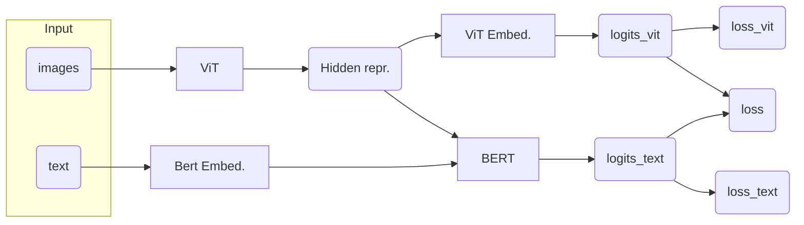

## Model

```mermaid
flowchart LR
    subgraph Input
        img
        text
    end
    img(images) --> ViT
    ViT --> hv(Hidden repr.)
    hv --> ve[ViT Embed.]
    ve --> lv(logits_vit)
    hv --> BERT
    text(text) --> be[Bert Embed.]
    be --> BERT
    BERT --> lt(logits_text)
    lv --> loss_vit(loss_vit)
    lt --> loss_t(loss_text)
    lv --> loss(loss)
    lt --> loss(loss)
```